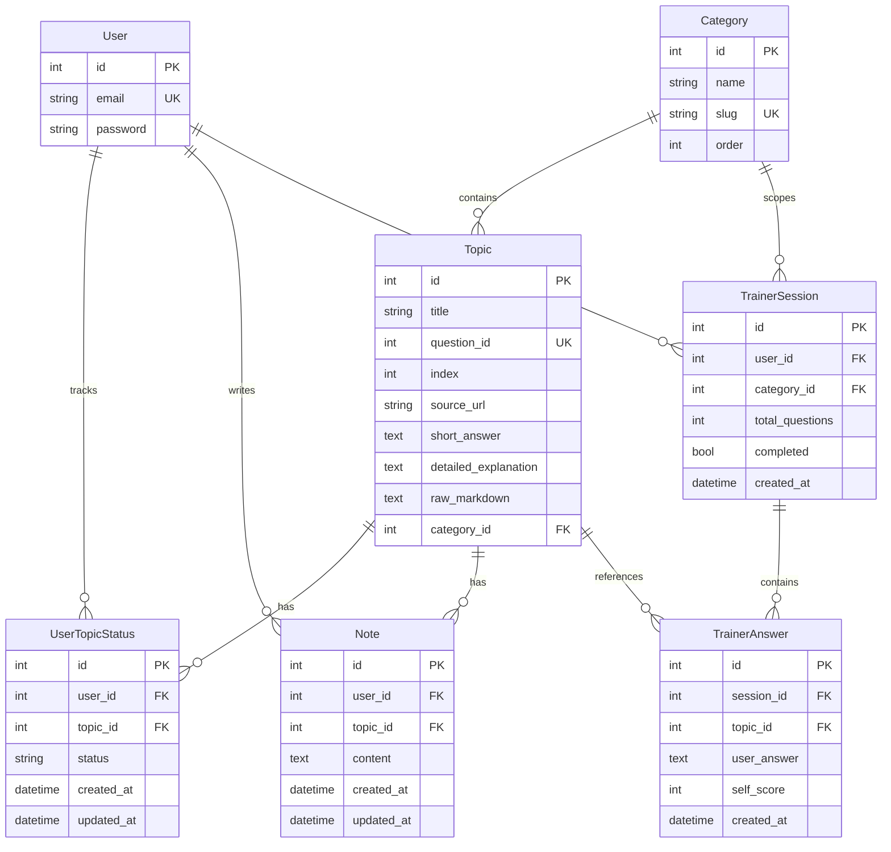

# StudyIt — Product Requirements Document

## 1. Product Overview

**StudyIt** — веб-платформа для підготовки до технічних співбесід з Python/Backend.
Дозволяє структуровано вивчати теми, відстежувати прогрес, тренуватися відповідати
на питання та отримувати оцінку через ChatGPT.

**Цільова аудиторія:** Python-розробники рівня Junior–Middle, які готуються до співбесід.

**Мова інтерфейсу:** українська.

---

## 2. Goals

- Структуроване вивчення 368 тем з 13 категорій
- Відстеження прогресу: що вивчено, що потребує повторення
- Тренажер з генерацією промпту для оцінки відповідей у ChatGPT
- Можливість експорту/імпорту прогресу між пристроями
- Замітки до кожної теми

---

## 3. User Stories

### Реєстрація та вхід

- US-1: Як користувач, я хочу зареєструватися за email + пароль, щоб мати персональний прогрес
- US-2: Як користувач, я хочу увійти в акаунт і залишатися залогіненим

### Перегляд тем

- US-3: Як користувач, я хочу бачити список категорій з кількістю тем і моїм прогресом
- US-4: Як користувач, я хочу переглядати теми у вибраній категорії
- US-5: Як користувач, я хочу відкрити тему і побачити коротку відповідь та детальне пояснення
- US-6: Як користувач, я хочу фільтрувати теми за статусом (нові / вивчені / на повторення)
- US-7: Як користувач, я хочу шукати теми за назвою

### Прогрес

- US-8: Як користувач, я хочу позначити тему як "вивчена"
- US-9: Як користувач, я хочу позначити тему як "потрібно повторити"
- US-10: Як користувач, я хочу скинути статус теми на "нова"
- US-11: Як користувач, я хочу бачити загальну статистику прогресу по категоріях

### Замітки

- US-12: Як користувач, я хочу додати замітку до теми
- US-13: Як користувач, я хочу редагувати та видаляти свої замітки

### Тренажер

- US-14: Як користувач, я хочу обрати категорію (або всі) та кількість питань для тренування
- US-15: Як користувач, я хочу бачити питання по одному та писати свою відповідь у текстове поле
- US-16: Як користувач, я хочу після завершення сесії отримати промпт для ChatGPT, який оцінить мої відповіді
- US-17: Як користувач, я хочу оцінити себе (1–5) по кожному питанню після перегляду правильної відповіді

### Експорт / Імпорт

- US-18: Як користувач, я хочу експортувати свій прогрес у JSON-файл
- US-19: Як користувач, я хочу імпортувати прогрес з JSON-файлу на іншому пристрої

---

## 4. Features & Priority

### P0 — Core (MVP)

- Реєстрація / логін (email + пароль, JWT)
- 13 категорій з темами (368 тем)
- Перегляд теми: коротка відповідь + детальне пояснення (markdown з підсвіткою коду)
- Статус теми: нова / вивчена / на повторення
- Список тем з фільтрацією за категорією та статусом

### P1 — Trainer

- Вибір категорії та кількості питань
- Покрокове проходження: питання → textarea для відповіді → наступне
- Генерація ChatGPT-промпту з усіма питаннями та відповідями
- Самооцінка 1–5 по кожному питанню

### P2 — Extras

- Замітки до тем (CRUD)
- Експорт / імпорт прогресу (JSON)
- Dashboard зі статистикою по категоріях
- Пошук тем за назвою

---

## 5. Data Model



---

## 6. Categories

| Slug | Name (UK) |
|------|-----------|
| `django` | Django |
| `docker` | Docker |
| `git` | Git |
| `http-api` | HTTP / API |
| `python` | Python |
| `tools-devops-linux` | Tools / DevOps / Linux |
| `algorithms` | Алгоритми |
| `architecture` | Архітектура |
| `async` | Асинхронність |
| `databases` | Бази даних |
| `oop` | ООП |
| `dev-processes` | Розробка та процеси |
| `testing` | Тестування |

---

## 7. API Endpoints

### Auth

| Method | Path | Description | Auth |
|--------|------|-------------|------|
| POST | `/api/auth/register/` | Реєстрація (email, password) | No |
| POST | `/api/auth/login/` | Логін → JWT tokens | No |
| POST | `/api/auth/refresh/` | Оновити access token | No |

### Topics

| Method | Path | Description | Auth |
|--------|------|-------------|------|
| GET | `/api/topics/categories/` | Список категорій з прогресом | Yes |
| GET | `/api/topics/` | Список тем (фільтр: category, status, search) | Yes |
| GET | `/api/topics/<id>/` | Деталі теми | Yes |
| POST | `/api/topics/<id>/status/` | Оновити статус теми | Yes |

### Notes

| Method | Path | Description | Auth |
|--------|------|-------------|------|
| GET | `/api/topics/<id>/notes/` | Замітки до теми | Yes |
| POST | `/api/topics/<id>/notes/` | Створити замітку | Yes |
| PUT | `/api/topics/notes/<id>/` | Оновити замітку | Yes |
| DELETE | `/api/topics/notes/<id>/` | Видалити замітку | Yes |

### Trainer

| Method | Path | Description | Auth |
|--------|------|-------------|------|
| POST | `/api/trainer/sessions/` | Створити сесію (category, count) | Yes |
| GET | `/api/trainer/sessions/<id>/` | Отримати сесію з питаннями | Yes |
| POST | `/api/trainer/sessions/<id>/answer/` | Відправити відповідь | Yes |
| GET | `/api/trainer/sessions/<id>/prompt/` | Отримати ChatGPT промпт | Yes |

### Progress

| Method | Path | Description | Auth |
|--------|------|-------------|------|
| GET | `/api/progress/export/` | Експорт прогресу (JSON) | Yes |
| POST | `/api/progress/import/` | Імпорт прогресу (JSON) | Yes |
| GET | `/api/progress/stats/` | Статистика по категоріях | Yes |

---

## 8. ChatGPT Prompt Format

Після завершення тренажера генерується промпт:

```
Ти — інтерв'юер, який оцінює знання кандидата з Python/Backend.
Нижче наведені питання та відповіді кандидата.

Для кожної відповіді:
1. Оціни від 1 до 10
2. Поясни, що було правильно і що пропущено
3. Дай коротку рекомендацію

Питання 1: {title}
Відповідь кандидата: {user_answer}

Питання 2: {title}
Відповідь кандидата: {user_answer}

...

В кінці:
- Дай загальний бал від 1 до 10
- Перелічи теми, які потребують додаткового вивчення
- Дай рекомендації щодо підготовки
```

---

## 9. Progress Export Format

```json
{
  "exported_at": "2026-03-02T12:00:00Z",
  "user": "user@example.com",
  "statuses": [
    { "question_id": 1336, "status": "studied" },
    { "question_id": 1216, "status": "review" }
  ],
  "notes": [
    { "question_id": 1336, "text": "Запам'ятати yield vs return" }
  ],
  "trainer_scores": [
    { "question_id": 1336, "self_score": 4, "session_date": "2026-03-01" }
  ]
}
```

При імпорті: merge статусів та заміток, конфлікти перезаписуються імпортованими даними.

---

## 10. UI Pages

### Login / Register
Проста форма з двома полями (email, password) та перемикачем між входом та реєстрацією.

### Dashboard
Карточки по кожній з 13 категорій з progress bar (% вивчено), загальний бал, список тем на повторення, кнопки експорту/імпорту.

### Topics List
Ліва панель — список категорій. Основна область — карточки тем з іконкою статусу (нова/вивчена/повторити). Пошук зверху. Фільтр за статусом.

### Topic Detail
Заголовок теми, бейджі статусу, кнопки "Вивчив" / "На повторення". Два розділи: коротка відповідь та детальне пояснення з підсвіткою коду. Внизу — секція заміток.

### Trainer Setup
Вибір категорії (dropdown або чіпси), слайдер кількості питань (5/10/15/20), кнопка "Почати".

### Trainer Session
Прогрес-бар зверху. Одне питання по центру. Textarea для відповіді. Кнопки "Далі" / "Пропустити".

### Trainer Results
Список питань з відповідями користувача. Самооцінка 1–5 для кожного. Copyable textarea з ChatGPT промптом. Кнопка "Скопіювати промпт".

---

## 11. Tech Stack

- **Backend:** Python 3.12, Django 5.x, Django REST Framework, djangorestframework-simplejwt, django-filter, django-cors-headers
- **Frontend:** Vue 3 (Composition API), Vite, Pinia, Vue Router, Tailwind CSS, Axios, markdown-it, highlight.js
- **Database:** SQLite (dev), PostgreSQL-ready
- **Architecture:** HackSoft Django Styleguide (services layer, thin APIs, BaseModel)

---

## 12. Non-Functional Requirements

- Responsive design (mobile-friendly)
- Markdown rendering з підсвіткою синтаксису Python, SQL, bash
- JWT access token — 30 хв, refresh token — 7 днів
- CORS дозволений для localhost (dev)
- Імпорт тем через management command

---

## 13. Out of Scope

- Інтеграція з ChatGPT API (тільки генерація промпту для копіювання)
- Алгоритм spaced repetition (тільки ручна позначка "на повторення")
- Мобільний додаток
- Мультимовність (тільки українська)
- Адмін-панель для управління темами (використовується Django admin)
- Real-time notifications
